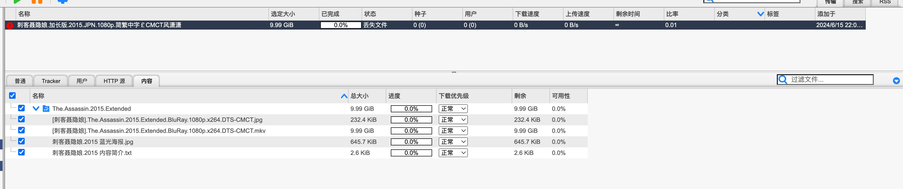

# Torrent File Matcher | [中文简介](./README-zh.md)

## Background

Recently, I've been tinkering with PT, using a Linux virtual machine to run qbitorrent-nox for download tasks. Due to incorrect language environment settings in Linux, [all non-ascii characters turned into dots](https://github.com/qbittorrent/qBittorrent/issues/16127). This issue was resolved by setting the environment variable: `LANG=en_US.UTF-8`. However, the filenames of already downloaded files are now dots, causing qbitorrent to report missing files. If a torrent has many files, renaming them can be tedious. Therefore, a script is needed to match the torrent file with the downloaded folder, and then rename the folder.


The structure of the downloaded folder is as follows:

```
❯ tree The.Assassin.2015.Extended -a
The.Assassin.2015.Extended
├── ......2015 .....jpg
├── ......2015 .....txt
├── [.....].The.Assassin.2015.Extended.BluRay.1080p.x264.DTS-CMCT.mkv
└── movie.nfo
```

The structure of the folder after using the script is as follows:

```
❯ node src/index.js "/Users/_/Downloads/刺客聂隐娘.加长版.2015.JPN.1080p.简繁中字￡CMCT风潇潇.torrent" "/Volumes/public_temp/download/movie/The.Assassin.2015.Extended" --dry-run
{
  _: [],
  'dry-run': true,
  d: true,
  dryRun: true,
  'rename-root': true,
  r: true,
  renameRoot: true,
  '$0': 'src/index.js',
  torrent: '/Users/_/Downloads/刺客聂隐娘.加长版.2015.JPN.1080p.简繁中字￡CMCT风潇潇.torrent',
  target: '/Volumes/public_temp/download/movie/The.Assassin.2015.Extended'
}
目标包含文件数量:4
种子名称: 刺客聂隐娘.加长版.2015.JPN.1080p.简繁中字￡CMCT风潇潇, 包含文件数量:4
目标地址包含多于文件,忽略 3618 /Volumes/public_temp/download/movie/The.Assassin.2015.Extended/movie.nfo
do rename /Volumes/public_temp/download/movie/The.Assassin.2015.Extended/......2015 .....txt -> /Volumes/public_temp/download/movie/刺客聂隐娘.加长版.2015.JPN.1080p.简繁中字￡CMCT风潇潇/刺客聂隐娘.2015 内容简介.txt
do rename /Volumes/public_temp/download/movie/The.Assassin.2015.Extended/......2015 .....jpg -> /Volumes/public_temp/download/movie/刺客聂隐娘.加长版.2015.JPN.1080p.简繁中字￡CMCT风潇潇/刺客聂隐娘.2015 蓝光海报.jpg
do rename /Volumes/public_temp/download/movie/The.Assassin.2015.Extended/[.....].The.Assassin.2015.Extended.BluRay.1080p.x264.DTS-CMCT.mkv -> /Volumes/public_temp/download/movie/刺客聂隐娘.加长版.2015.JPN.1080p.简繁中字￡CMCT风潇潇/[刺客
聂隐娘].The.Assassin.2015.Extended.BluRay.1080p.x264.DTS-CMCT.mkv
```

## Usage

You can run the script with the following command:

```bash
node src/index.js <torrent file> <target directory> [--rename-root] [--dry-run]
```

Where:

- `<torrent file>` is the path to the torrent file.
- `<target directory>` is the root directory path of the files corresponding to the torrent file.
- `--rename-root` is an optional flag. If set, the target root directory will be renamed to the name of the torrent file. Enabled by default.
- `--dry-run` is an optional flag. If set, no actual operations will be performed, but the operations to be performed will be printed out. Disabled by default.

## Function

The script first reads the torrent file and target directory, grouping by file size. Then it matches the files in the torrent file and target directory based on file size and name. If the `--rename-root` flag is set, it will also rename the root directory to the name of the torrent file.

If the `--dry-run` flag is set, the script will print out the operations it will perform, but will not perform any actual operations.

## Limitations

The file directory structure inside the torrent file and the target directory must be confirmed to be consistent.

## Dependencies

This script requires Node.js and the following npm packages:

- `yargs`
- `lodash-es`
- `fastest-levenshtein`
- `parse-torrent`

You can install these dependencies with the following command:

```bash
npm install
```

## License

This script is released under the MIT license.


